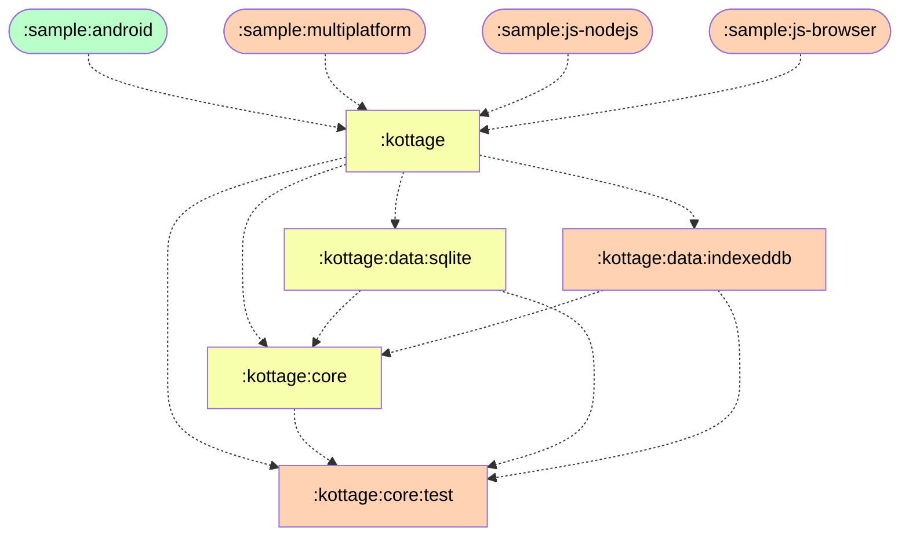

```mermaid
flowchart TD
    classDef mpp fill:#ffd2b3,color:#000000
    classDef mpp_android fill:#f7ffad,color:#000000
    classDef android fill:#baffc9,color:#000000
    classDef java fill:#ffb3ba,color:#000000
    classDef other fill:#eeeeee,color:#000000

    %% Modules

    :kottage[:kottage]; class :kottage mpp_android
    :kottage:core[:kottage:core]; class :kottage:core mpp_android
    :kottage:core:test[:kottage:core:test]; class :kottage:core:test mpp
    :kottage:data:indexeddb[:kottage:data:indexeddb]; class :kottage:data:indexeddb mpp
    :kottage:data:sqlite[:kottage:data:sqlite]; class :kottage:data:sqlite mpp_android
    :sample:android([:sample:android]); class :sample:android android
    :sample:js-browser([:sample:js-browser]); class :sample:js-browser mpp
    :sample:js-nodejs([:sample:js-nodejs]); class :sample:js-nodejs mpp
    :sample:multiplatform([:sample:multiplatform]); class :sample:multiplatform mpp

    %% Dependencies

    :kottage -.-> :kottage:data:sqlite
    :kottage -.-> :kottage:core
    :kottage -.-> :kottage:data:indexeddb
    :kottage -.-> :kottage:core:test
    :kottage:core -.-> :kottage:core:test
    :sample:android -.-> :kottage
    :sample:multiplatform -.-> :kottage
    :sample:js-nodejs -.-> :kottage
    :sample:js-browser -.-> :kottage
    :kottage:data:sqlite -.-> :kottage:core
    :kottage:data:sqlite -.-> :kottage:core:test
    :kottage:data:indexeddb -.-> :kottage:core
    :kottage:data:indexeddb -.-> :kottage:core:test
```
